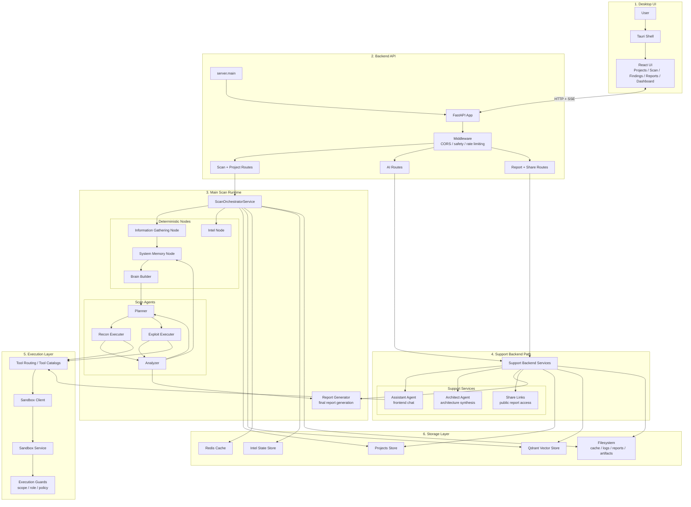

# PentaForge Main Architecture

## Reading Order

1. The user works in the **Tauri + React desktop UI**.
2. The UI calls the **FastAPI backend**.
3. Scan requests enter the **main scan runtime**:
   `Orchestrator -> Nodes -> Planner -> Recon/Exploit -> Analyzer -> Memory/Planner loop`.
4. Chat and architecture generation go through a separate **support AI path**.
5. Real tool execution happens through the **sandbox layer**.
6. State, vectors, cache, and artifacts are stored in the **storage layer**.
